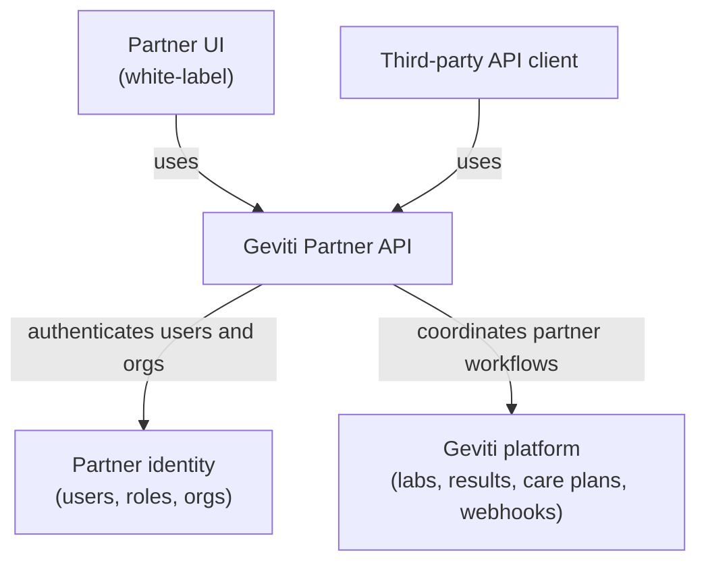

# Architecture

## Partner-Facing Shape

## Responsibility Split

| Layer | Responsibility |
| --- | --- |
| Partner UI | White-label member, admin, and practitioner screens. Uses only Partner API. |
| Third-party API client | Partner system integration. Uses OAuth or API credentials and webhooks. |
| Partner API | Partner resource model, tenancy enforcement, auth scopes, audit logging, idempotency, webhooks, and stable response shapes. |
| Partner identity | User identity, organization membership, SSO where needed, and admin/practitioner/member roles. |
| Geviti platform | Bloodwork ordering, scheduling, upload processing, lab results, intake, care plans, and partner notifications. |

## Contract Rules

- Partner clients only see partner-scoped identifiers such as `mem_`, `labord_`, `labres_`, `cp_`, and `we_`.
- Partner-visible IDs are opaque and stable.
- Every request resolves to a partner organization before data access.
- Every state transition is auditable.
- Partner API responses use a consistent status model across lab ordering, uploads, results, and care plans.
- Long-running operations should be visible through resource status and webhooks, not synchronous blocking calls.

## Integration Assumption

Partners should only integrate with documented Partner API endpoints. The contract should stay stable even as Geviti changes operational processes, lab partners, or care plan tooling.

## Partner Boundary

The partner boundary should be:

- Stable enough for partner integrations.
- Focused on partner-approved capabilities.
- Explicit about unavailable states and clinical review requirements.
- Versioned from day one under `/v1`.
