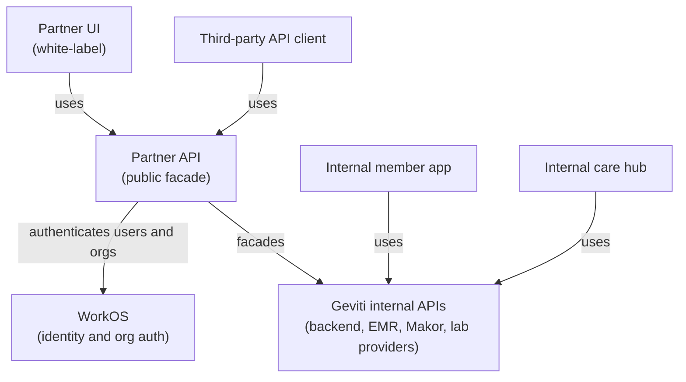

# Architecture

## Proposed Shape

## Responsibility Split

| Layer | Responsibility |
| --- | --- |
| Partner UI | White-label member, admin, and practitioner screens. Uses only Partner API. |
| Third-party API client | Partner system integration. Uses OAuth or API credentials and webhooks. |
| Partner API | Public resource model, tenancy enforcement, auth scopes, audit logging, idempotency, webhooks, stable DTOs. |
| WorkOS | User identity, organization membership, SSO where needed, admin/practitioner/member roles. |
| Internal APIs | Existing Geviti capabilities: bloodwork ordering, scheduling, upload processing, lab results, intake, care plans. |
| Internal member app | Current Geviti member experience. Should not be a dependency of partner clients. |
| Internal care hub | Current clinical/admin operations. Partner API should expose a limited, partner-safe care review surface. |

## Facade Rules

- Public clients only see partner-scoped identifiers such as `mem_`, `labord_`, `labres_`, `cp_`, and `we_`.
- Provider-specific IDs are stored internally and returned only in an `external_reference` field when explicitly allowed.
- Every request resolves to a partner organization before data access.
- Every state transition is auditable.
- Partner API responses should be normalized even if internal workflows differ by lab provider, upload path, or care plan generator.
- Long-running operations should be visible through resource status and webhooks, not synchronous blocking calls.

## Deployment Assumption

The Partner API can be built as a new service or API module, but it should own its public DTOs and not let internal route shapes leak into partner documentation. It can call existing Geviti backend and EMR services behind the scenes.

## Public Boundary

The public boundary should be:

- Stable enough for partner integrations.
- Smaller than internal capabilities.
- Explicit about unavailable states and clinical review requirements.
- Versioned from day one under `/v1`.
