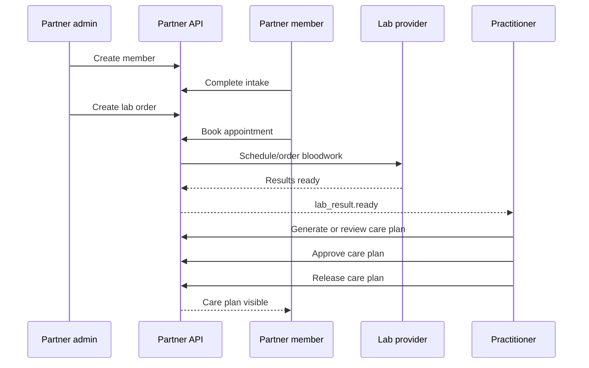

# Workflows

## Member Enrollment To Released Care Plan

## Partner Admin Orders Labs

1. Admin creates or selects a partner member.
2. API verifies organization access, member eligibility, and required intake state.
3. Admin creates a lab order with a supported `panel_code`.
4. API creates the internal order and returns a public `labord_` ID.
5. Member or admin schedules the appointment.
6. API sends webhooks as the order moves through scheduling, draw, processing, results, and review.

## Member Uploads Existing Bloodwork

1. Member uploads a PDF through the Partner UI.
2. API stores the upload under the partner and member.
3. Internal processing extracts and normalizes results.
4. API emits `lab_upload.processed` or `lab_upload.processing_failed`.
5. If processing succeeds, a `labres_` resource is created.
6. A care plan can be generated from that lab result.

## Practitioner Reviews A Care Plan

1. Practitioner opens unreleased care plan draft.
2. API verifies practitioner role and assigned organization.
3. Practitioner edits recommendations, adds a review note, or requests regeneration.
4. Practitioner approves the plan.
5. Approved plan can be released to the member.
6. API emits `care_plan.approved` and `care_plan.released`.

## Third-Party Integration Flow

1. Partner obtains machine credentials.
2. Partner creates or syncs members using `external_id`.
3. Partner creates lab orders with idempotency keys.
4. Partner consumes webhooks for status changes.
5. Partner fetches results or care plan summaries only when its scopes allow it.

## Operational Rules

- Duplicate member creation should resolve by `external_id` or email according to partner config.
- Duplicate lab order creation should be prevented by `Idempotency-Key`.
- Care plan release should require an approved care plan unless the partner is explicitly configured for auto-release.
- Result visibility should be configurable by partner type and role.
- Webhook delivery must not be the only source of truth; partners can always poll resources by ID.
